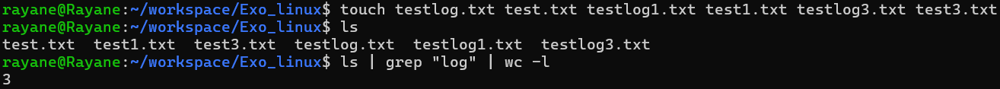
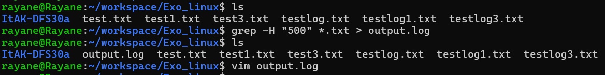
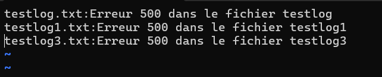
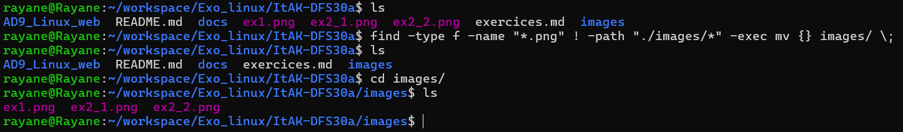

### Filtrer et compter des lignes

Commande : ls | grep "log" | wc -l

### Rechercher un motif

Commande : grep -H "500" *.txt > output.log

### Déplacer des fichiers

Commande : find -type f -name "*.png" ! -path "./images/*" -exec mv {} images/ \

